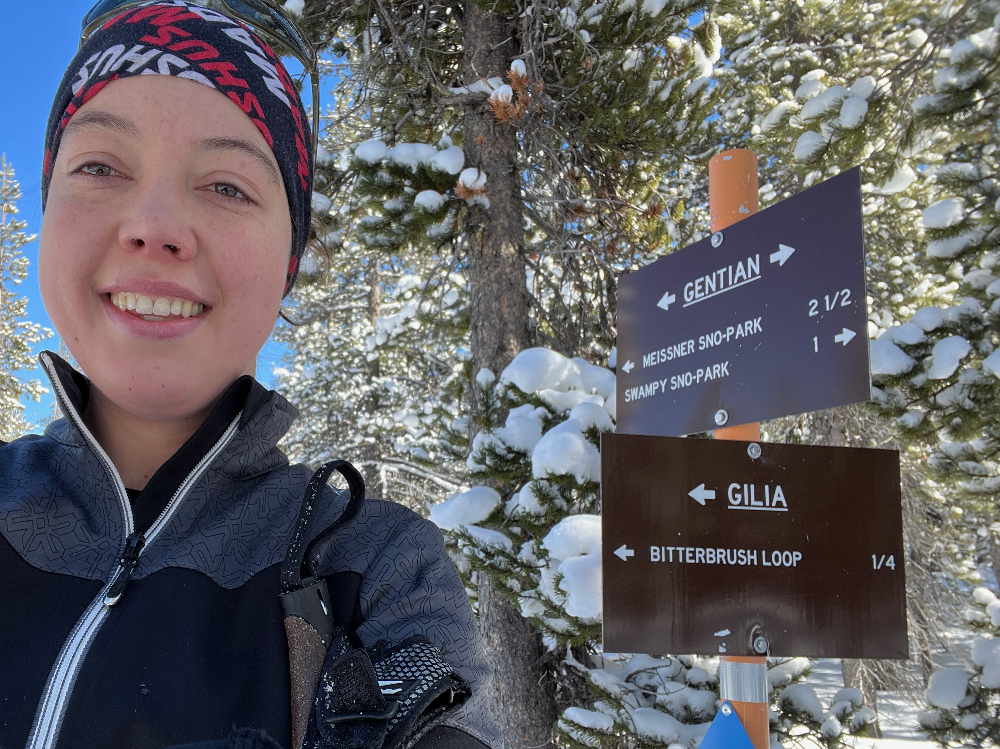

I am a postdoc in the [Computational Ecology Lab](https://www.cellab.org/) at the University of Montana. I did my PhD in the [Kern-Ralph Co-lab](https://kr-colab.github.io/) at the University of Oregon. I develop computational methods to inform conservation using genetic data.

